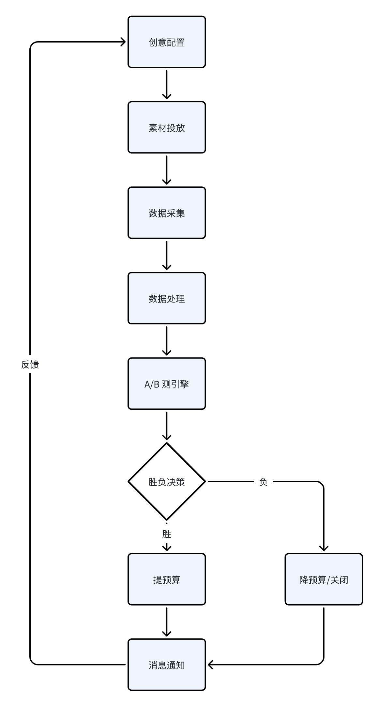

# 第一题
``` shell
go run main.go -i tasks.csv -c 10 -a 3
```
## 增强可观测性
1. 记录每次请求日志，根据执行结果分级（Info，Warning，Error）
2. 定义失败次数，重试次数，耗时等 metrics，配合 Prometheus 和 Grafana 采集数据
## 止损方案
1. 保留完整操作日志，方便追踪，记录替换前 creative_id 配备回滚脚本，替换为原 creative 或直接关闭相关 ad
2. 实现批量暂停 ad 逻辑，支持快速响应
3. 早期可选择小范围更新，或者接入风控系统（重要指标骤降）更早发现问题
# 第二题

## 创意配置
* 接收创意素材并标注
* 选择人群包、多个投放渠道
* 选择监控指标 CPI CPR ROI
* 设置测试周期，预算分配规则
## 素材投放
* 接入多个投放渠道 API
## 数据采集
* 实时定时采集多个投放渠道数据，统一结构化 
* 可选用 airflow 和 aws fargate 构建定时任务系统
## 数据处理
* 数据清洗，补全
* 按需聚合，生成多维度统计
## A/B 测引擎
* 通过科学的统计方法判定创意效果差异确定优胜者
## 预算调整
* 为胜出创意组增加预算，关闭过降低失败组预算
## 通知
* 接入飞书通知，将此次 A/B 测结果发送给订阅者
* 并反馈给创意配置促进下一轮 A/B 测
# 第三题
## 自动化生成与适配
### 应用场景
人工生产周期长，效率低
### 技术实现
基于产品特性、目标人群、优化目标等条件 ，利用 GPT，SD，Midjourney 等模型分别生成文本、图片、视频类素材
## 风险控制与策略精细化调整
### 应用场景
人工调整依赖经验，难以应对复杂海量的流量
### 技术实现
暂时还没有完整的思路，实现方式通过 AI 做了了解较为复杂
## 投放效果预测
### 应用场景
传统方式效果评估较为滞后，提前预测可规避风险提升 ROI
### 技术实现
基于用户行为、上下文环境、创意特征等数据做深度 CTR/CVR 预测